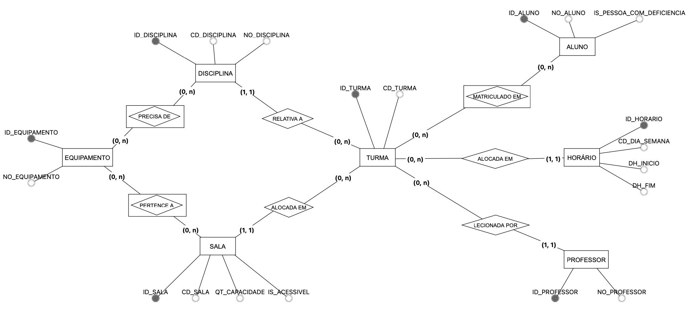
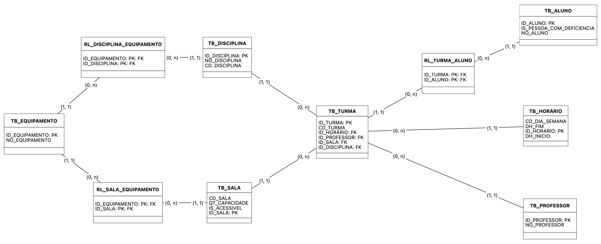

# [PRJ3] Sistema para Alocação de Salas e Professores

## Descrição
A gestão acadêmica de disciplinas, turmas, professores, salas e equipamentos envolve um conjunto de decisões interdependentes que impactam diretamente na qualidade do ensino e na eficiência institucional. Este projeto tem como objetivo modelar e implementar um banco de dados capaz de auxiliar a alocação de recursos acadêmicos, considerando fatores como capacidade das salas, disponibilidade de equipamentos, horários e matrícula dos alunos. A proposta busca apoiar a tomada de decisão de forma precisa, garantindo o cumprimento de requisitos técnicos, demandas institucionais e políticas de inclusão.

## Requisitos

### Originais

1. **Gerenciar disciplinas, horários e matrículas**
   1. Consultar quantidade de matrículas em uma turma
   2. Consultar horários com mais salas livres

2. **Alocar salas conforme demanda e requisitos técnicos**
   1. [Demanda] Consultar capacidade da sala vs número de alunos matriculados
   2. [Requisitos técnicos] Consultar quais salas têm todos os equipamentos necessários para uma disciplina

3. **Controlar disponibilidade de professores**
   1. Consultar horários disponíveis de um professor
   2. Consultar dias da semana com maior carga horária de um professor

4. **Gerenciar equipamentos disponíveis em cada sala**
   1. Consultar equipamentos com maior estoque
   2. Consultar disponibilidade de equipamentos em um horário

5. **Gerar relatórios de ocupação**
   1. Consultar quantidade de turmas em uma sala
   2. Consultar horários ocupados em uma sala

6. **Evitar conflitos de horário e superlotação**
   1. [Conflitos de horário] Consultar horários mais requisitados (com mais turmas alocadas)
   2. [Superlotação] Consultar turmas próximas da capacidade máxima

### Estendidos

7. **Limitar para que alunos não estejam matriculados em mais de uma turma da mesma disciplina**
   1. Consultar disciplinas com múltiplas turmas
   2. Consultar todas as turmas de um aluno

8. **Matricular alunos com deficiência apenas em salas com acessibilidade**
   1. Consultar disponibilidade de turmas alocadas em salas acessíveis
   2. Consultar porcentagem de alunos com deficiência de uma turma

9. **Gerenciar a distribuição de carga horária dos professores**
   1. Consultar carga horária de um professor
   2. Consultar distribuição de disciplinas de um professor

10. **Gerenciar a distribuição de carga horária dos alunos**
    1. Consultar carga horária de um aluno
    2. Consultar dias da semana com maior carga horária de um aluno

## Minimundo

### Descrição

O sistema acadêmico possui:

1. **Equipamentos** - Cada equipamento possui um **identificador único (ID_EQUIPAMENTO)** e **nome (NO_EQUIPAMENTO)**.

2. **Disciplinas** - Cada disciplina possui um **identificador único (ID_DISCIPLINA)**, **código (CD_DISCIPLINA)** e **nome (NO_DISCIPLINA)**.

3. **Salas** - Cada sala possui um **identificador único (ID_SALA)**, **código (CD_SALA)**, **capacidade (QT_CAPACIDADE)** e **indicador de acessibilidade (IS_ACESSIVEL)**.

4. **Horários** - Cada horário possui um **identificador único (ID_HORARIO)**, **dia da semana (CD_DIA_SEMANA)**, **hora de início (DH_INICIO)** e **hora de fim (DH_FIM)**.

5. **Professores** - Cada professor possui um **identificador único (ID_PROFESSOR)** e **nome (NO_PROFESSOR)**.

6. **Alunos** - Cada aluno possui um **identificador único (ID_ALUNO)**, **nome (NO_ALUNO)** e **indicador de pessoa com deficiência (IS_PESSOA_COM_DEFICIENCIA)**.

7. **Turmas** - Cada turma possui um **identificador único (ID_TURMA)**, **código (CD_TURMA)** e está associada a uma **disciplina (ID_DISCIPLINA)**, um **horário (ID_HORARIO)**, um **professor (ID_PROFESSOR)** e uma **sala (ID_SALA)**.

### Relacionamentos

1. **Disciplina-Equipamento** - Relacionamento entre **disciplinas (ID_DISCIPLINA)** e **equipamentos (ID_EQUIPAMENTO)**, indicando quais equipamentos são necessários para cada disciplina.

2. **Sala-Equipamento** - Relacionamento entre **salas (ID_SALA)** e **equipamentos (ID_EQUIPAMENTO)**, indicando quais equipamentos estão disponíveis em cada sala.

3. **Turma-Aluno** - Relacionamento entre **turmas (ID_TURMA)** e **alunos (ID_ALUNO)**, indicando quais alunos estão matriculados em cada turma.

### Restrições

- Uma **sala** pode possuir vários equipamentos e um **equipamento** pode estar disponível em várias salas.
- Uma **disciplina** pode precisar de vários equipamentos e um **equipamento** pode ser necessário para várias disciplinas.
- Uma **turma** pode possuir vários alunos matriculados e um **aluno** pode estar matriculado em várias turmas.
- Uma **turma** está associada a uma única **disciplina**, mas uma **disciplina** pode ser ministrada em várias turmas.
- Uma **turma** está alocada em uma única **sala**, mas uma **sala** pode alocar várias turmas.
- Uma **turma** está alocada a um único **horário**, mas um **horário** pode ser utilizado por várias turmas.
- Uma **turma** é lecionada por um único **professor**, mas um **professor** pode lecionar em várias turmas.

## Modelo de Dados

### Entidades

**Equipamento (TB_EQUIPAMENTO)**
- ID_EQUIPAMENTO (PK)
- NO_EQUIPAMENTO

**Disciplina (TB_DISCIPLINA)**
- ID_DISCIPLINA (PK)
- CD_DISCIPLINA
- NO_DISCIPLINA

**Sala (TB_SALA)**
- ID_SALA (PK)
- CD_SALA
- QT_CAPACIDADE
- IS_ACESSIVEL

**Horário (TB_HORARIO)**
- ID_HORARIO (PK)
- CD_DIA_SEMANA
- DH_INICIO
- DH_FIM

**Professor (TB_PROFESSOR)**
- ID_PROFESSOR (PK)
- NO_PROFESSOR

**Aluno (TB_ALUNO)**
- ID_ALUNO (PK)
- NO_ALUNO
- IS_PESSOA_COM_DEFICIENCIA

**Turma (TB_TURMA)**
- ID_TURMA (PK)
- CD_TURMA
- ID_DISCIPLINA (FK)
- ID_HORARIO (FK)
- ID_PROFESSOR (FK)
- ID_SALA (FK)

### Relacionamentos

**Disciplina-Equipamento (RL_DISCIPLINA_EQUIPAMENTO)**
- ID_DISCIPLINA (FK)
- ID_EQUIPAMENTO (FK)

**Sala-Equipamento (RL_SALA_EQUIPAMENTO)**
- ID_SALA (FK)
- ID_EQUIPAMENTO (FK)

**Turma-Aluno (RL_TURMA_ALUNO)**
- ID_TURMA (FK)
- ID_ALUNO (FK)

## Modelo de Entidade-Relacionamento (MER)

### Modelo Conceitual



### Modelo Lógico



## Configuração do Banco de Dados

### Requisitos

- Docker
- Docker Compose
- Make

### Configuração Inicial

1. Clone o repositório:
```bash
git clone git@github.com:BeatrizCerqueira/mata60-banco-de-dados.git
cd mata60-banco-de-dados
```

2. Inicie o banco de dados usando Docker:
```bash
make run-db
```

Este comando irá:
- Iniciar o container do PostgreSQL;
- Aguardar até que o banco de dados esteja pronto para conexões;
- Os scripts de criação das tabelas e inserção de dados iniciais serão executados automaticamente durante a inicialização do container.

### Executando Consultas

Para executar as consultas, você pode usar o comando `make executar-consulta` especificando o número da consulta desejada. Por exemplo:

```bash
make executar-consulta CONSULTA=1
```

Este comando irá executar a consulta `C01_*.sql`. O mesmo se aplica para as demais consultas.

### Outros Comandos Úteis

- `make run-db`: Inicia o container do banco de dados PostgreSQL
- `make run-down-db`: Para o container do banco de dados
- `make restart-db`: Reinicia o container do banco de dados

## Avaliação de Desempenho

Para avaliar o desempenho das consultas SQL, foi criado um script Python que mede o tempo de execução de cada consulta. O script executa cada consulta 20 vezes e calcula estatísticas como tempo médio, desvio padrão, tempo mínimo e tempo máximo.

### Requisitos

- Docker
- Docker Compose
- Make

### Execução

Para executar a avaliação de desempenho:

```bash
make avaliar-desempenho
```

O script irá:
1. Para cada configuração (sem indexação e planos 1, 2, 3 e 4):
   - Aplicar o plano de indexação (exceto para sem indexação);
   - Executar cada consulta 20 vezes;
   - Calcular tempo médio, desvio padrão, tempo mínimo e tempo máximo de cada consulta.
   - Salvar os resultados em `avaliacao_de_desempenho/resultados/<plano>/execucoes.csv`
2. Gerar resumo comparativo com métricas gerais de cada plano em `avaliacao_de_desempenho/resultados/resumo.csv`

### Resultados

Os resultados são salvos em dois arquivos:

1. `execucoes.csv` (em cada pasta de plano):
   - Nome da consulta
   - Tempo médio de execução (em milissegundos)
   - Desvio padrão (em milissegundos)
   - Tempo mínimo de execução (em milissegundos)
   - Tempo máximo de execução (em milissegundos)

2. `resumo.csv` (na pasta resultados):
   - Nome do plano
   - Média geral de tempo de execução
   - Desvio padrão geral

### Outros Comandos Úteis:

- `make run`: Compila o projeto e inicia todos os containers;
- `make run-down`: Para todos os containers;
- `make restart`: Reinicia todos os containers;
- `make executar-medicao-desempenho [PLANO=N]`: Executa a medição de desempenho. Se PLANO não for especificado, executa sem indexação. Se PLANO for especificado, executa com o plano de indexação N;
- `make aplicar-plano-indexacao PLANO=N`: Aplica um plano de indexação específico (onde N é o número do plano);
- `make avaliar-desempenho-plano PLANO=N`: Avalia o desempenho de um plano específico;
- `make avaliar-desempenho`: Executa a avaliação completa de desempenho para todos os planos.
